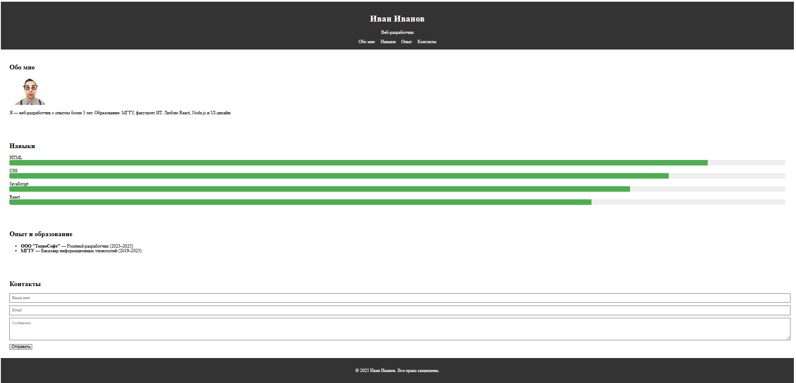
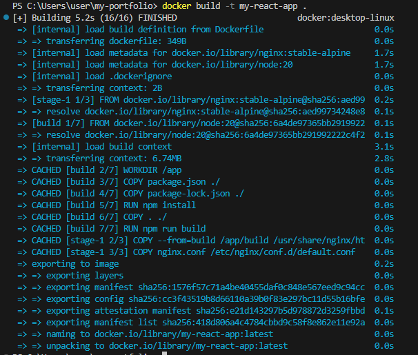
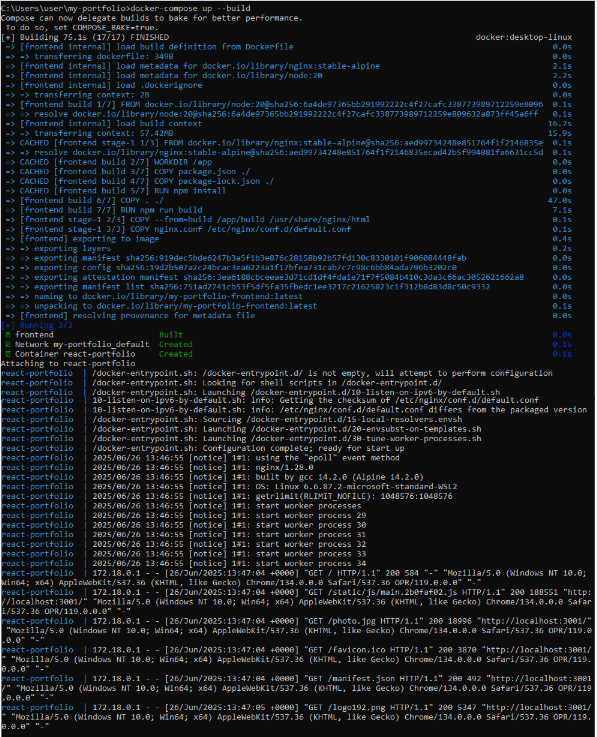

# React SPA Portfolio

## 📌 Описание

Одностраничное React-приложение (SPA), разработанное в рамках практической работы по МДК 02.02.  
Содержит:

- Раздел "Обо мне"
- Навыки с прогресс-барами
- Образование и опыт работы
- Контактную форму
- Контейнеризацию через Docker + nginx
 

## 🐳 Docker 

### 📦 Сборка Docker-образа

Для создания Docker-образа выполните команду:
docker build -t my-react-app .
 

### ▶️ Запуск контейнера

Запустите приложение с помощью docker-compose:
docker compose up --build .

### Ссылка на проект https://github.com/volodyn4/my-portfolio